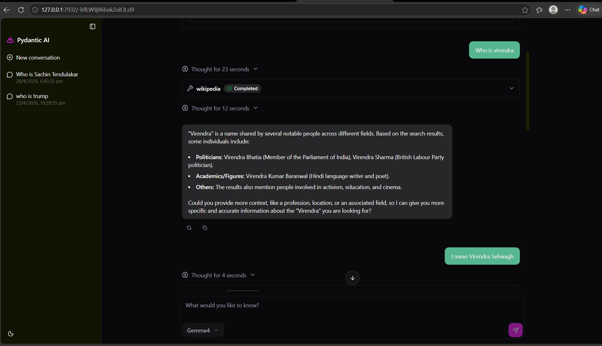

# agent_demo
This repo demonstrates the agent capabilities provided by pydentia_ai python library and ollama gemma4 model

Custom wikipedia agent has various tools like duckduckgo_search, WebFetch, Wikipedia scrawling ability.

### How to run using pydantic UI

`uvicorn pydantic_ui:app --host 127.0.0.1 --port 7932`

### To run this application as a Fast API Server to communicate with agent use below command.

In development mode: `fastapi dev main.py`

In development mode: `fastapi prod main.py`